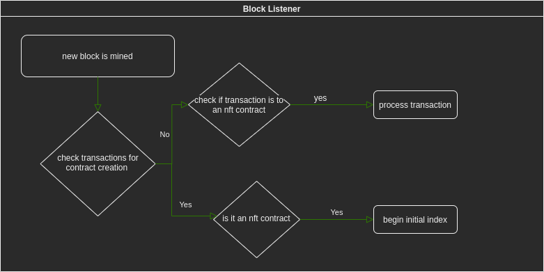
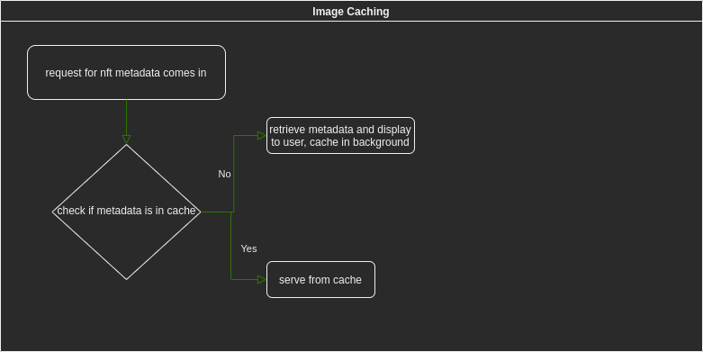

# Overview

Proposed architecture for an NFT Indexer service. To ensure scalabilitiy and fault tolerance the system is broken up into multiple different components. In addition to this a database is used for storing information long-term in a manner that is fast to retrieve from. All NFT Indexer components will be available as docker images, with the entire setup runnable thorugh docker-compose locally for development. For the more savy folks docker images can be used along with more fancier deployments a-la kubernetes, docker swarm, etc...

# Components

## Data Collector

The data collector is an umbrella for multiple different microservices that are responsible for scraping data from the blockchain. This data is primarily composed of NFT contract creation transactions, NFT minting transactions, and NFT transfer transactions. In addition there is the need to capture historical data. For the purpose of this proposal historical data is data from blocks that were mined up to whatever block is the current latest block at the time an NFT Indexer deployment is brought online for the first time. For example if NFT Indexer is deployed at block height 1234, historical data would be all data contained in blocks 1 -> 1234.

To handle this the data collector is broken down into two components:

* block listener
* back filler

### Block Listener

The block listener is fairly simple in that it listens for new blocks to be mined. When a new block is mined processing is conducted via a background process that runs concurrently while new blocks are listened for. This ensures that processing a block doesn't block listening for new blocks.

A simple flow chart of high-level functions performed by the block listener is included below

Detailed explanation of these components is included below

**Check Transactions For Contract Creation**

* check if the rcipient address is the all 0 address, this indicates a contract deployment
* if the recipient address is not the all 0 address, check if the contract is known to NFT Indexer as being an NFT contract

**Check If Transaction Is To An NFT Contract**

* Check if the contract address is previously known to NFT Indexer as an NFT contract, if it is not known perform an interface check to see if the contract conforms to ERC721 standards. More information on this is included later in this section

**Is It An NFT Contract**

* Conduct an interface conformance check as detailed below

**Begin Initial Index**

* Initial index consists of performing base data gathering of the NFT contract, including metadata if supported by the contract.
* For contracts that dont support the metadata specification this means only collecting contract deployer, and contract address

**Process Transaction**

* This would invovle parsing the calldata to see what specific contract method is being invokved, it's arguments, etc...
* Using this information the database can be updated as needed
* To check whether or not an NFT was minted we parse transaction receipt logs for `Transfer` event from all 0 address to non all 0 address

**ERC721 Interface Conformance Checking**

* Using [ERC-165](https://eips.ethereum.org/EIPS/eip-165) we can ensure that the specified contract contains all required interfaces.
* One potential method of accomplishing is this by manually querying the contract for all required interfaces. The downside with this is that it requires many RPC calls to the target node.
* Another potential method of accomplishing this would be using a "multicall" style contract that would query the target contract for all required interfaces only requiring a single RPC call. Personally this is my preferred option as its the most effective in terms of latency and total RPC calls required.

### Back Filler

The backfiller is equivalent to the block listener in terms of functionality performed, except it is responsible for checking all blocks mined before an NFT Indexer deployment was brought online for the first time. In addition to this it acts as a verify for the block listener to ensure that all data scraped by the block listener is correct, and that no data is missing.

The verification component of the backfiller should run at a minimum 12 blocks after whatever block the information the block lsitener scraped was contained in in order to handle uncle blocks. This means that if the block listener scraped information for block 1235, the verification aspect of the backfiller would run at a minimum after block 1247 is mined.

## Database

A database will be used for persisting information long-term, and reducing lookup times. For just ERC-721 support two tables will be needed, for ERC-1155 support three tables will be needed. A "state" table will be used for storing the current running state of NFT Indexer, allowing for graceful restarts if any program errors are encountered, outages are suffered, etc... The specific database implementation will be PostgreSQL as it is widely supported. Given columns aren't finalized and may be subject to change

**State Table**

| Column Name | Purpose | Data Type |
|-------------|---------|-----------|
| block_listener_height | records the current height of the block listener, used for conducting data restoration in the event of an outage which may lead to missing mined blocks | int64 |
| back_filler_height | records the last block at which a backfill precodure was conduct. once this is 0 no more backfilling is needed | int64 |
| back_filler_verification_height | indicates the last block height at which verification of the block listener scraped data was conducted at | int64 |

**ERC721 Table**

| Column Name | Purpose | Data Type |
|-------------|---------|-----------|
| contract_address | address of the specific erc721 contract | string |
| deployer | address of the contract deployer | string |
| supports_metadata | indicates if the contract supports metadata | boolean |
| tokenid_owner |  maps owners of a given tokenID in an easily updateable manner. index 0 of the array corresponds to to the owner of tokenID 0, index 1 of the array corresponds to the owner of tokenID 1 | string array |
| tokenid_uri | for nfts which support metadata this contains the metadata URI of the tokenID. semantics are the same as `tokenid_owner` | string array

**ERC1155 Table**

TBD

## API

The API will allow querying the indexed nft data. Initially the API will be a regular HTTP REST API as this is more widely supported. Given that one of the grants is marked as integrating with subgraph, the GraphQL API component can be taken care of by integrating with The Graph. If integration with The Graph isn't desired, a dedicated GraphQL API can be written. However I have a few comments on this detailed at the end of the proposal.

At a minimum the following API methods will be needed. Note these aren't finalized and may be subject to change. HTTP API will be written in a specification such as OpenAPI that allows for automatically generating client libraries in a multitude of languages.

**Status API**

ex: `/status`

* Used for retrieve API status and checking if the API is online
* Returns block height, back filler height and verification height, as well as total number of NFTs indexed

**ERC721 API**

ex: `/erc721/{contractAddress}`

* Used for retrieving general information about the given contract

ex: `/erc721/{contractAddress}/owner/{tokenID}`

* returns the given owner of the specific tokenID

ex: `/erc721/{contractAddress}/uri/{tokenID}`

* returns the given URI of the metadata for the tokenID if available

**ERC1155 API**

TBD

## Image/Metadata Caching

Given that NFTs contain metadata which may or may not be an image, it can potentially be difficult to check whether or not this metadata is an image. As such I'm proposing that this caching layer just be a generalized cache for the metadata. If this is undesirable I can add in some logic that performs mime type detection but this may not always be accurate. Metadata will be cached in redis as it is widely supported.

For maximum performance anytime a cache miss occurs (request for metadata comes in and that data is not cached) the data will be retrieved and displayed to the user, while simultaneously initiating a background process to cache the data in redis.

# Deliverables

**Brief**

* A microservice style product that is self-hostable, and easy to deploy. It will allow for the indexing of newly created, and historical NFTs. Tracking owners, metadata, and minting with the abiltiy to cache metadata.
* All work hours logged along with link to pull requests, etc..

**Detailed***

* Open-Source Code (license TBD, preferrence for Apache 2.0 or dual licensed as done by Protocol Labs)
* Thorough code coverage through unit and integration tests
* CI integration with either TravisCI or CircleCI along with proper release cycles
* Thoroughly commented code that is clean, and easy to read
* Docker images for everything
* Docker compose file for local-deployment suitable for testing
* HTTP API defined in a spec like OpenAPI allowing for generating SDKs in different languages
* Documentation including readme, usage, etc...

# Work Hours Involved

Time ranges in terms of hours are given to provide a buffer room in case any unexpected errors are encountered.

**Breakdown**

* "Data Collector"
  * 15 -> 20 hours
* Docker Images / Docker Compose 
  * 1 -> 3 hours
* HTTP API
  * 3 -> 10 hours
* Database tooling and integration (migration tools, schema creation, etc..)
  * 3 -> 5 hours
* Redis caching design and integration
  * 2 -> 5 hours

**Cost**

* Hourly rate of $115/hr
* Minimum hours: 24 ($2760-USD)
* Maximum hours: 43 ($4945-USD)
* Note: given work hours do not factor in The Graph integration, or ERC-1155 integration. ERC-1155 integration would probably add another 5 -> 10 hours to data collector development, and 1 or 2 hours to database tooling.
* Payment method: Due to volatile market prices stablecoins are preferred (preferrence order: DAI -> USDC -> USDT) but ETH is acceptable. If payment is done outside of stablecoins or ETH it must be in an **extremely liquid** asset along with a 15% premium to account for transaction fees, market volatility, etc... The asset must also be decided upon before grant work is started.

# Misc Comments/Questions

General questions or comments for discussion are listed below

## Questions

* How long should metadata be cached for? Personally I think 7 days with refreshes on cache hits is good to minimize long term costs
* Should ERC-1155 be supported? Personally I think yes however I have left it out of this proposal for now
* Is a multicall style contract truly necessary for determining whether a contract is an ERC721 or ERC1155 contract? Personally I think so as it will greatly reduce latency for determining if a contract is ERC721 or ERC1155.

## Comments

* There are many potential modifications to the given NFT Indexer design including things like tracking transfers, and contract interactions. These may be worth additional discussion
* Consider evaluating whether or not integration with The Graph is necessary. Given that NFT Indexer requires a significant architecture which is specific to NFT Indexer (database, caching, data scraping, transaction processing, etc..) adding integration with The Graph would make NFT Indexer dependent on third-party integrations. An outage with The Graph could potentially make NFT Indexer non-functional thus increasing poitns of failure. Integrating with The Graph would also mean needing to create the subgraph, making sure that whatever data is being queried is also available by The Graph thus increasing architectural complexity. Once The Graph becomes a fully incentivized protocol it means that NFT Indexer operators would also need to make sure The Graph nodes are paid for their hosting service. This increases long term costs.
* I think a HTTP API is sufficient for the purposes of NFT Indexer. A GraphQL API could be implemented, or leveraged via The Graph but it might be more than what is needed.

